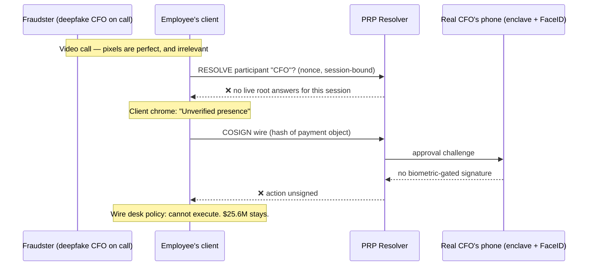

# This You?

**A new answer to the YC RFS ["Proving You're Human"](https://www.ycombinator.com/rfs) — researched, then designed.**

In January 2024, a finance worker at Arup joined a video call with his CFO and colleagues and wired out US$25.6M across 15 transfers. Every other person on that call was a deepfake. He had *suspected phishing* — and the call is what convinced him. The channel we use to verify humans is now the easiest thing to fake, deepfake fraud attempts grew >1,300% in 2024, and generative-AI fraud losses are projected to reach $40B in the US by 2027.

This repo contains two documents:

| Doc | What it is |
|---|---|
| [**RESEARCH.md**](./RESEARCH.md) | Adversarially fact-checked survey of every deployed approach — CAPTCHAs, World ID & proof-of-personhood, KYC, liveness/deepfake detection, C2PA, passkeys, personhood-credential and delegation research — how each works, its documented real-world bypasses, and the *structural law* it dies by. Ends with the gap analysis: the empty quadrant nothing occupies. |
| [**SOLUTION.md**](./SOLUTION.md) | **The Presence Resolution Protocol (PRP)** — the new design built against those laws. |

## The research in five laws

Every documented failure is one of these:

1. **Detection loses to generation** — classifiers vs generators is a lost race (CAPTCHAs fell first, deepfake detectors are falling the same way; injection attacks skip the sensor entirely).
2. **Point-in-time verification rots** — anything verified once becomes a durable credential, and durable credentials get rented ($20 World IDs, GenAI-KYC'd bank accounts).
3. **Global uniqueness doesn't scale honestly** — billion-scale biometric dedup is gameable both directions and requires an irrevocable biometric honeypot; social dedup is impossible (bodies can be hired — observed in the wild).
4. **Proof attached to the wrong object gets detached** — C2PA manifests are stripped at every platform boundary; passkey logins say nothing about who operates the session afterward. Nobody attaches proof to the objects that get forged: *the live interaction* and *the consequential action*.
5. **Identity ≠ humanness ≠ authority, and AI agents break all three** — no deployed protocol traces an agent's action back to an authorizing human beyond one hop, and valid credentials can't witness intent under prompt injection.

## The solution in one inversion

Every failed system makes the human **carry** a proof (credential, badge, manifest, session). Carried proofs get rented, stripped, and go stale.

**PRP makes the counterparty *resolve* the human instead — like DNS, like OCSP.** Your devices' secure enclaves, gated by an on-device biometric that never leaves them, answer live challenges: continuously during interactions (**RESOLVE**), at the moment of each consequential action (**COSIGN**), and on behalf of AI agents acting under scoped, instantly-revocable, human-rooted grants (**DELEGATE**). Three assertion tiers — *a live human* / *the same human as before* / *this named human* — so verifiers request the minimum and privacy is the default.

Deepfakes are not detected. They are **disconnected**: perfect pixels, no resolvable root behind them.

**Why rental — the attack that kills every personhood system — dies here:** the "credential" is a stream of freshly biometric-gated answers. Renting it means supplying your device, your face, and your participation for every challenge, forever, for one identity at a time (concurrency is attested). The marginal cost of a fake human returns to ≈ the cost of a real one — the economics the internet's trust signals were built on.

**Wedge:** COSIGN for enterprise payments — single-company adoption, no network effect needed, kills the Arup/BEC category on day one and is priced against it. Then: presence SDK for meeting platforms, delegation API for the agent economy. Endgame is the YC line itself — *the layer every bank, app, and video call checks before it trusts anyone.*

## Method note

Research was produced by a fan-out multi-agent pipeline (16 sources fetched, 79 claims extracted, top 25 adversarially verified by 3-vote refutation panels; 24 survived, 1 refuted claim excluded). Confidence labels and votes are in [`RESEARCH.md`](./RESEARCH.md) appendices; coverage gaps are declared, not papered over.
